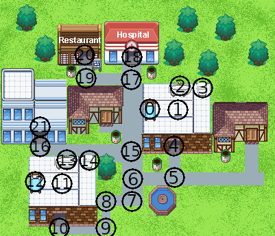

# SURVIVOR-AI
A simple game environment to test which
machine learning algorithm is best for
manage human necessities like energy and hunger.

For default, the survivors can use Random Forest
or Decision Tree algorithms to make decisions.
To make the survivor move to the desired destiny
the BFS algorithm to search the best path to destiny.
The graph of the game is in below image.


# Requirements
- Python >= 3.8
- OS: Any
- For graphviz lib (used in [Train_survivor](src/ML/Train_survivor.ipynb)) utilization in linux systems
it may be necessary to install libstdcxx-ng

# Installation
1. Clone this repository
    ```bash
   git clone https://github.com/Rene-Michel99/survivor-ai.git
    ```
2. Install dependencies
   ```bash
   cd survivor-ai
   pip install -r requirements.txt
   ```
3. Run the main file
   ```bash
   python3 main.py
   ```